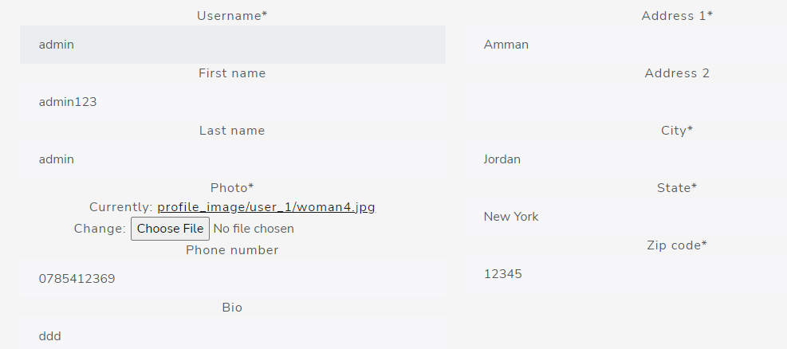
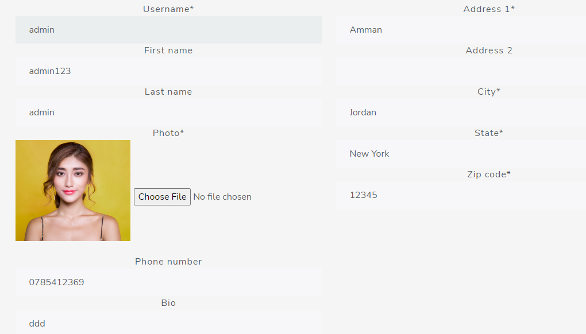

# custom wedgets in django

A widget is Django’s representation of an HTML input element. The widget handles the rendering of the HTML, and the extraction of data from a GET/POST dictionary that corresponds to the widget.

The HTML generated by the built-in widgets uses HTML5 syntax, targeting `<!DOCTYPE html>`. For example, it uses boolean attributes such as `checked` rather than the XHTML style of `checked='checked'`.

for the profile page the image appears like this 

when we add the widget it will be shown like this

